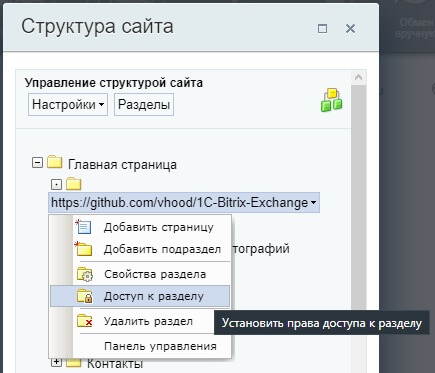

# Обмен 1С с битрикс сайтом на стороне сайта

> Note: this is a web page for data exchange between the "1C" program and the "1C:Bitrix" CMS, which are popular in Russia.

Данный проект - веб-страница, которая интегрируется в Ваш сайт на битриксе и помогает мониторить обмен между 1С и сайтом.  
Эта страница позволит Вам:

- Тестировать компоненты обмена битрикса
- Узнать на чьей стороне проблемы с обменом
- Узнать ошибки обмена благодаря онлайн логам

## Установка

Скачать и установить проект можно несолькими способами:

1. **С помощью git**
    - [Установите git](https://git-scm.com/download/linux) на сервер с сайтом, если он не установлен
    - Перейдите в публичную директорию сайта (`cd /home/bitrix/www`)
    - Создайте папку для страницы обмена (например, `mkdir exchage`)
    - Скопируйте проект с репозитория в эту папку `git clone https://github.com/vhood/1C-Bitrix-Exchange exchange/`

2. **Скачать вручную**
    - Скачайте последний релиз [из списка](https://github.com/vhood/1C-Bitrix-Exchange/releases)
    - Загрузите его на сайт в отдельную папку в проекте (например, `exchange/`)

Если Вы не меняли логику построения URL, страница станет доступна по адресу вида `domain.com/exchange/`

## Настройка

Для проведения обмена необходимо:

1. Выгрузить данные из 1С в xml файл
2. Загрузить xml файл на сервер в публичную директорию сайта по адресу `./upload/1c_catalog/`
3. Перейти на страницу с обменом. Если Вы все сделали правильно, во вкладке *"Обмен"* будет выбор загруженных файлов
4. Перейти во вкладку *"Настройки"*
5. Указать путь до нужного компонента обмена (стандартно `/bitrix/admin/1c_exchange.php`)
6. Во вкладке *"Обмен"* выберите файл, тип файла и нажмите *"Начать обмен"*

### Настройки безопасности

Обязательно ограничьте доступ к данной странице. Сделать это можно сделующим образом:

1. На панели управления нажмите *"Структура"* и выберите страницу с обменом
2. Нажмите *"Доступ к разделу"*

3. В открывшемся окне настройте ограничения по группам пользователей

* * *

[История изменений](CHANGELOG.md)
